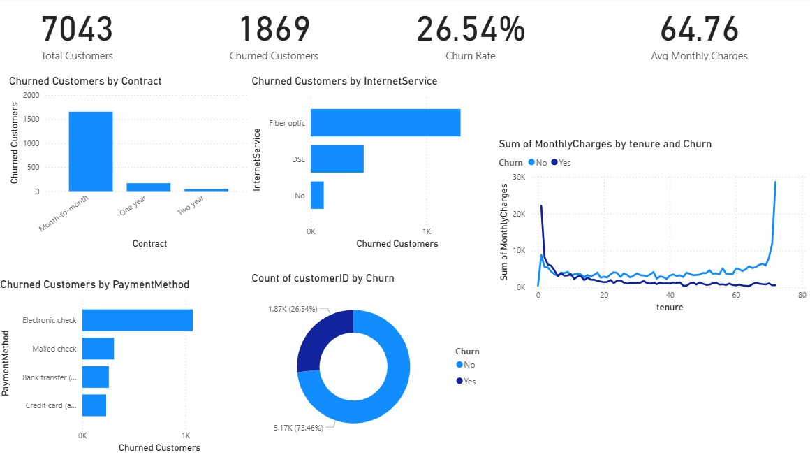

# Customer Churn Analysis Dashboard

## Project Overview

This project analyzes customer churn patterns in a telecom company using Power BI and Python. The objective is to identify key factors contributing to customer attrition and provide insights to improve customer retention.

## Tools Used

- Power BI
- Python
- Pandas
- Excel
- GitHub

## Key KPIs

- Total Customers: 7,043
- Churned Customers: 1,869
- Churn Rate: 26.54%
- Average Monthly Charges: 64.76

## Dashboard Preview

## Key Insights

- Month-to-month customers show the highest churn.
- Fiber optic customers churn more frequently than DSL users.
- Electronic check users have the highest churn rate.
- Long-term contracts improve customer retention.
- Approximately 73.46% of customers were retained.

## Business Recommendations

- Encourage customers to move from month-to-month plans to long-term contracts.
- Improve customer support and retention strategies for fiber optic users.
- Investigate issues faced by customers using electronic check payments.
- Launch targeted retention campaigns for high-risk customer segments.

## Project Files

- `customer_churn_cleaned.csv` - Cleaned dataset
- `customer_churn_dashboard.pbix` - Power BI dashboard
- `dashboard.png` - Dashboard screenshot
- `analysis.ipynb` - Python analysis notebook

## Author

Sai Shashank R# customer-churn-analysis-dashboard
Customer Retention | Contract Analysis | Churn Drivers | Customer Segmentation
